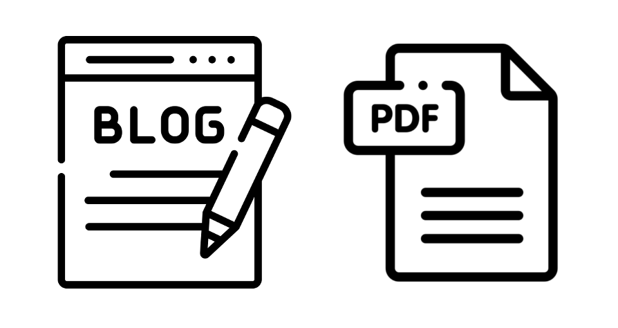
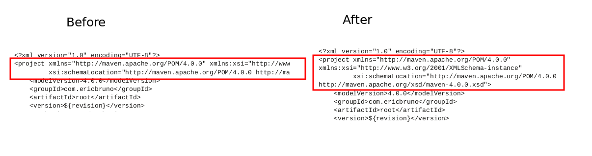
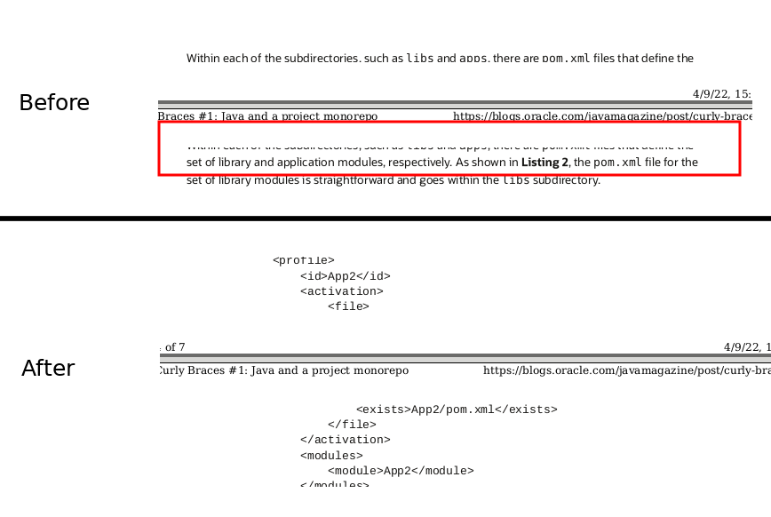

# Oracle Blogs Userstyle
Userstyle to improve the print style of Oracle Blogs, because I prefer reading printed material.

## Installation instructions
- Install using Stylish: https://userstyles.org/styles/236097/oracle-blogs-improved-print-style
- Install using Stylus: https://userstyles.world/style/4081/oracle-blogs-improved-print-style

## Whitespace improvements
- Removes empty first page
- Removes social media buttons
- Shrink margins
- Removes copy code button

## Code improvements
Prevents code from being cut off by wrapping lines

## Page break improvements
Prevents text from being cut off by page breaks

### Icon attribution
<a href="https://www.flaticon.com/free-icons/blog" title="blog icons">Blog icons created by Freepik - Flaticon</a> 
<a href="https://www.flaticon.com/free-icons/pdf" title="pdf icons">Pdf icons created by Freepik - Flaticon</a>